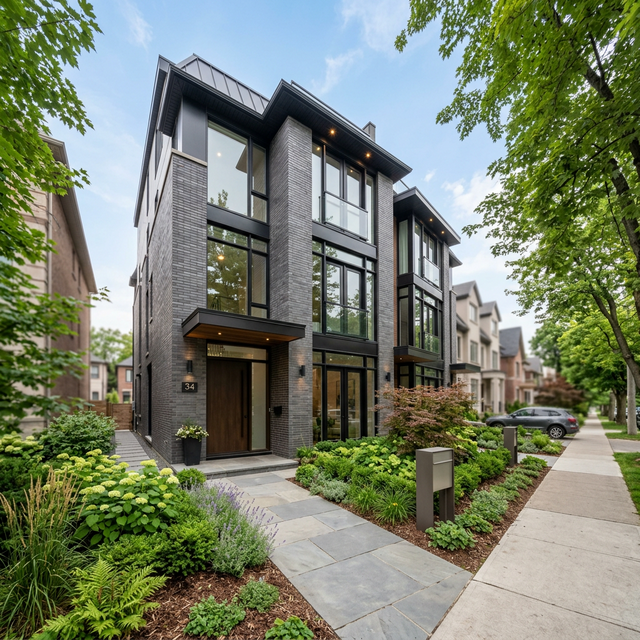

# UrbanRent

UrbanRent is a full-stack rental platform for tenants, property managers, and administrators. It covers property discovery, rental applications, approval workflows, invoicing, Razorpay test payments, messaging, and role-based operations.

## Live Demo

- **Frontend:** [urban-rent-amber.vercel.app](https://urban-rent-amber.vercel.app)
- **API:** [urban-rent-f94j.onrender.com/api](https://urban-rent-f94j.onrender.com/api)
- **API health:** [health check](https://urban-rent-f94j.onrender.com/api/health)

## Demo Access

### Credential-free preview

Open [the demo role selector](https://urban-rent-amber.vercel.app/demo). Choose Tenant, Property Manager, or Admin to inspect the main dashboards and navigation without creating an account.

This is a preview mode. It is intentionally separate from authenticated data mutations and payments.

### Complete rental workflow

For the end-to-end workflow, use Clerk test accounts:

1. Create one test account with the `tenant` role.
2. Create a second test account with the `manager` role.
3. Use the tenant account to browse a verified property and submit an application.
4. Sign in as the manager, open Applications, and approve the application.
5. Return to the tenant account, open Payments, and complete the invoice using Razorpay test mode.

No production credentials are stored in this repository. Admin access is reserved for local or private review environments.

## Golden Path

The primary product flow is:

`Browse map and listings -> View property -> Apply -> Manager approval -> Invoice -> Razorpay test payment`

The flow demonstrates the core data relationships between `Property`, `Application`, `Invoice`, and `Payment`, with Clerk identity verification and MongoDB-managed roles at the API boundary.

## Mobile Walkthrough

Open the live demo from a phone and check this sequence:

1. Open `/demo` and select Tenant.
2. Open Properties or Search from the mobile navigation.
3. Open a property card and verify the image, rent, location, and primary action fit without horizontal scrolling.
4. Sign in with the tenant test account and submit an application.
5. Switch to the manager test account and approve the application.
6. Return to the tenant account and verify the invoice and Razorpay checkout remain usable at narrow width.
7. Confirm the back navigation, menu drawer, buttons, and form fields remain reachable with one hand.

## Screenshots





## What It Demonstrates

- Clerk authentication with server-verified Bearer tokens
- MongoDB as the authoritative source for user roles
- Property discovery with Leaflet maps and filters
- Tenant applications and manager approval workflows
- Invoice generation and Razorpay test-mode payments
- Socket.IO messaging and notifications
- Cloudinary-backed property media uploads
- Admin review, suspension, and diagnostic workflows
- AI-assisted editor prototype with mocked enhancement actions

## Stack

| Area | Technology |
|---|---|
| Frontend | React 19, Vite, Tailwind CSS |
| Backend | Node.js, Express, Socket.IO |
| Authentication | Clerk, Svix webhook verification |
| Database | MongoDB Atlas, Mongoose |
| Maps | Leaflet, React-Leaflet |
| Payments | Razorpay Node SDK |
| Media | Cloudinary, Multer |

## Run Locally

```bash
cd client
npm install
npm run dev
```

In a second terminal:

```bash
cd server
npm install
npm run dev
```

The server requires a private `server/.env` file. See [`client/.env.production`](client/.env.production) for the frontend variable names and keep server secrets out of the client bundle.

## Project Structure

```text
client/  React application and role-based user interfaces
server/  Express API, authentication middleware, controllers, and models
```

## Author

**Nityam Savaliya**
